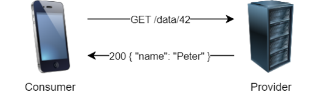
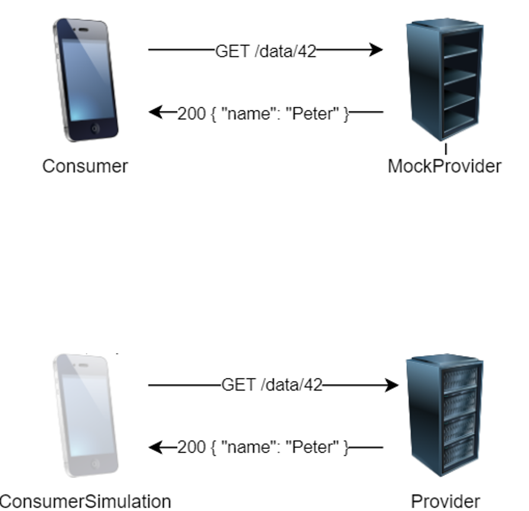
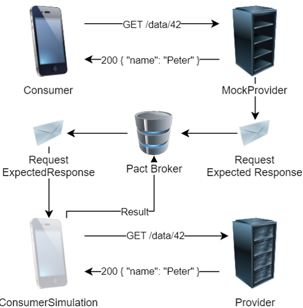

### Integrationstests

<-->

### Bewertung

* Integration sichergestellt 

*  Abhängigkeiten

* spätes Feedback

* instabile Tests

* hoher Wartungsaufwand

<--->

### Isolierte Tests

</img>

<-->

### Bewertung 

* Integration nicht sichergestellt 

* Unabhängigkeiten

* schnelles Feedback

* stabile Tests

* geringer Wartungsaufwand

<--->

### PACT

</img>

<-->

### Bewertung 

* Integration sichergestellt 

* Unabhängigkeiten

* schnelles Feedback

* stabile Tests

* geringer Wartungsaufwand

<--->
### PACT mit Broker

</img>

<-->

### Zusätzliche Features 

* Visualisierung von
   * Testergebnis
   * Abhängigkeiten

* Versionierung

* CI-Integration

<--->

Beispiel

<--->

### Wozu ist PACT geeignet

Test von APIs (REST/Kafka/JMS/...) hinsichtlich

* Consumer:
  * Korrektheit des Requests
  * Verarbeitung der Response

* Provider:
  * Verarbeitung des Requests
  * Korrektheit der Response

<-->
### Wozu ist PACT nicht geeignet

* Contract ohne Absprache definieren

* Funktionale Tests von Providerlogiken   
(z.B. Validierungen)

<--->

### CI-Integration

* Deployment des Providers verhindern
  
  * Testergebnis in Build prüfen

<-->

### CI-Integration
* Deployment des Consumers verhindern
  
  * Consumer-Build triggert über Webhook Verification-Build des Providers
  
  * Provider triggert über Webhook Consumer-Deployment-Build
